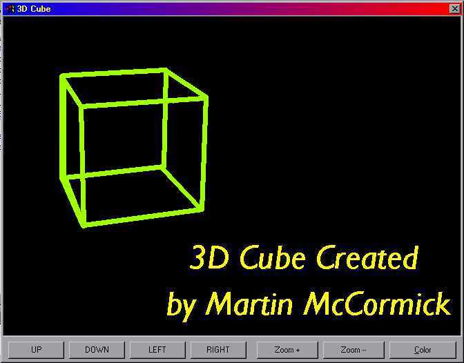



## Cool interactive 3D cube

### Description

Cool 3D cube: you can rotate in four dirctions, you can zoom and change colors too!
 
### More Info
 

             |
---                |---
**Submitted On**   |2000-11-14 16:06:46
**By**             |[Wåzerface](https://github.com/Planet-Source-Code/PSCIndex/blob/master/ByAuthor/w-zerface.md)
**Level**          |Intermediate
**User Rating**    |4.0 (16 globes from 4 users)
**Compatibility**  |VB 5\.0, VB 6\.0
**Category**       |[Complete Applications](https://github.com/Planet-Source-Code/PSCIndex/blob/master/ByCategory/complete-applications__1-27.md)
**World**          |[Visual Basic](https://github.com/Planet-Source-Code/PSCIndex/blob/master/ByWorld/visual-basic.md)
**Archive File**   |[CODE\_UPLOAD1168911142000\.zip](https://github.com/Planet-Source-Code/w-zerface-cool-interactive-3d-cube__1-12791/archive/master.zip)

